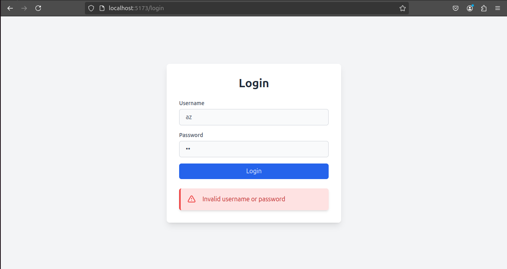

# HerCRM Development Guide

This document outlines the steps to create an ERP and CRM software for a premium ladies' gym, including an attendance recording system using ESSL Magnum and other related hardware.

## Project Timeline

- **Total Days Allocated**: 25 days
- **Number of Holidays**: 5 days
- **Total Working Days**: 20 days (~3 weeks)
- **Final Demo Date**: 23rd September 2023

## Technology Stack

Since we have a limited timeline to build a customized software solution, we'll be using the stack we're most familiar with:

- **Frontend**: React with Vite
- **Styling**: Tailwind CSS with Material UI
- **Backend**: Supabase

## Getting Started

### 1. Setting Up the React Vite App

First, let's create the React Vite app and install Tailwind CSS:

```bash
npm create vite@latest 
```

- **Project Name**: `hercrm`
- **Template**: `react`

Navigate into the project directory and install dependencies:

```bash
cd hercrm
npm install 
```

### 2. Installing and Configuring Tailwind CSS

Install Tailwind CSS along with PostCSS and Autoprefixer:

```bash
npm install -D tailwindcss postcss autoprefixer
npx tailwindcss init -p
```

Replace the contents of `tailwind.config.js` with the following:

```javascript
/** @type {import('tailwindcss').Config} */
export default {
  content: [
    "./index.html",
    "./src/**/*.{js,ts,jsx,tsx}",
  ],
  theme: {
    extend: {},
  },
  plugins: [],
}
```

Replace the contents of `index.css` with:

```css
@tailwind base;
@tailwind components;
@tailwind utilities;
```

### 3. Initial App Setup

Replace the contents of `App.jsx` with:

```jsx
import { useState } from 'react';
import './App.css';

export default function App() {
  return (
    <h1 className="text-3xl font-bold underline">
      Hello world!
    </h1>
  );
}
```

### 4. Creating Pages and Routes

Create a `pages` directory inside the `src` folder. We'll create three pages:

- **PrivateRoute.jsx**: Prevent unauthorized access
- **LoginPage.jsx**: Handle user login
- **HomePage.jsx**: Redirect users after successful login

### 5. Implementing the App Component

Replace the contents of `App.jsx` with:

```jsx
import React, { useEffect, useState } from 'react';
import { BrowserRouter as Router, Routes, Route, Navigate } from 'react-router-dom';
import LoginPage from './pages/LoginPage';
import PrivateRoute from './pages/PrivateRoute';
import HomePage from './pages/HomePage';

const App = () => {
  const [isAuthenticated, setIsAuthenticated] = useState(false);

  useEffect(() => {
    const user = JSON.parse(localStorage.getItem('user'));
    if (user && user.username === 'jagan') {
      setIsAuthenticated(true);
    }
  }, []);

  return (
    <Router>
      <Routes>
        <Route path="/login" element={<LoginPage setIsAuthenticated={setIsAuthenticated} />} />
        <Route element={<PrivateRoute isAuthenticated={isAuthenticated} />}>
          <Route path="/" element={<HomePage />} />
        </Route>
        <Route path="*" element={<Navigate to={isAuthenticated ? "/" : "/login"} />} />
      </Routes>
    </Router>
  );
};

export default App;
```

### 6. Creating the Home Page

Create a `HomePage.jsx` in the `pages` directory:

```jsx
import React from 'react';

const HomePage = () => {
  const logout = () => {
    localStorage.removeItem('user');
    window.location.href = '/login';
  };

  return (
    <div className="flex flex-col items-center justify-center min-h-screen bg-gray-100">
      <h1 className="text-4xl font-bold text-gray-800 mb-8">Welcome, Jagan!</h1>
      <button
        onClick={logout}
        className="px-4 py-2 text-white bg-red-600 rounded-md hover:bg-red-700 focus:outline-none focus:ring-2 focus:ring-red-500 focus:ring-offset-2 transition duration-150 ease-in-out"
      >
        Logout
      </button>
    </div>
  );
};

export default HomePage;
```

### 7. Creating the Login Page

Create a `LoginPage.jsx` in the `pages` directory:

```jsx
import React, { useState } from 'react';
import { useNavigate } from 'react-router-dom';

const LoginPage = ({ setIsAuthenticated }) => {
  const [credentials, setCredentials] = useState({ username: '', password: '' });
  const [error, setError] = useState('');
  const [loading, setLoading] = useState(false);
  const navigate = useNavigate();

  const handleInputChange = (e) => {
    const { name, value } = e.target;
    setCredentials((prev) => ({ ...prev, [name]: value }));
  };

  const handleLogin = (e) => {
    e.preventDefault();
    setLoading(true);
    setError('');

    if (credentials.username === 'jagan' && credentials.password === 'jagan') {
      const userData = { username: 'jagan' };
      localStorage.setItem('user', JSON.stringify(userData));
      setIsAuthenticated(true);
      navigate('/');
    } else {
      setError('Invalid username or password');
    }

    setLoading(false);
  };

  return (
    <div className="flex items-center justify-center min-h-screen bg-gray-100">
      <div className="w-full max-w-md p-8 space-y-6 bg-white rounded-lg shadow-lg">
        <h1 className="text-3xl font-bold text-center text-gray-800">Login</h1>
        <form onSubmit={handleLogin} className="space-y-4">
          <InputField
            type="text"
            id="username"
            name="username"
            value={credentials.username}
            onChange={handleInputChange}
            label="Username"
            className="w-full px-4 py-2 text-gray-700 bg-gray-50 border border-gray-300 rounded-md focus:outline-none focus:ring-2 focus:ring-blue-500 focus:border-transparent transition duration-150 ease-in-out"
          />
          <InputField
            type="password"
            id="password"
            name="password"
            value={credentials.password}
            onChange={handleInputChange}
            label="Password"
            className="w-full px-4 py-2 text-gray-700 bg-gray-50 border border-gray-300 rounded-md focus:outline-none focus:ring-2 focus:ring-blue-500 focus:border-transparent transition duration-150 ease-in-out"
          />
          <button
            type="submit"
            className="w-full px-4 py-2 text-white bg-blue-600 rounded-md hover:bg-blue-700 focus:outline-none focus:ring-2 focus:ring-blue-500 focus:ring-offset-2 transition duration-150 ease-in-out disabled:bg-blue-300 disabled:cursor-not-allowed"
            disabled={loading}
          >
            {loading ? 'Logging in...' : 'Login'}
          </button>
        </form>
        {error && <CustomAlert message={error} />}
      </div>
    </div>
  );
};

const InputField = ({ type, id, name, value, onChange, label, className }) => (
  <div className="space-y-1">
    <label htmlFor={id} className="block text-sm font-medium text-gray-700">
      {label}
    </label>
    <input
      type={type}
      id={id}
      name={name}
      value={value}
      onChange={onChange}
      required
      className={className}
    />
  </div>
);

const CustomAlert = ({ message }) => (
  <div className="bg-red-100 border-l-4 border-red-500 text-red-700 p-4 rounded-md shadow-md mt-4" role="alert">
    <div className="flex items-center">
      <svg className="h-6 w-6 text-red-500 mr-4" xmlns="http://www.w3.org/2000/svg" fill="none" viewBox="0 0 24 24" stroke="currentColor">
        <path strokeLinecap="round" strokeLinejoin="round" strokeWidth={2} d="M12 9v2m0 4h.01m-6.938 4h13.856c1.54 0 2.502-1.667 1.732-3L13.732 4c-.77-1.333-2.694-1.333-3.464 0L3.34 16c-.77 1.333.192 3 1.732 3z" />
      </svg>
      <p>{message}</p>
    </div>
  </div>
);

export default LoginPage;
```

### 8. Creating PrivateRoute

Create a `PrivateRoute.jsx` in the `pages` directory:

```jsx
import React from 'react';
import { Navigate, Outlet } from 'react-router-dom';

const PrivateRoute = ({ isAuthenticated }) => {
  return isAuthenticated ? <Outlet /> : <Navigate to="/login" />;
};

export default PrivateRoute;
```

### 9. Final Output

Below is an image of what the login page will look like:

